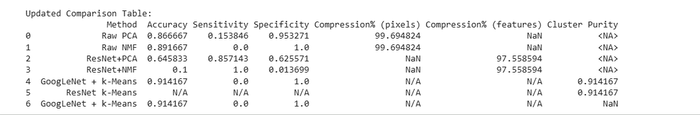

# Failure Cases/ Exluded methods
1. Library and Compatibility Failures: unsuccessful integration of SqueezeNet and Vision Transformer (ViT) due to irreconcilable library and compatibility issues with the current TensorFlow/Keras environment. Therefore, no feature extraction or evaluation was performed for these models.

2. Raw NMF Unexpected Outcome: resulted in 0.0% sensitivity despite high accuracy and perfect specificity. this indicates a complete failure to detect the 'Cardiomegaly' class, likely due to the model defaulting to predicting the dominant 'No Finding' class in an imbalanced dataset since this label has the highest occurencies in the data set = 60361.

3. GoogLeNet + k-Means Unexpected Outcome:  unexpected outcome of GoogLeNet + k-Means classification, which also showed 0.0% sensitivity for 'Cardiomegaly', despite achieving high cluster purity and accuracy. failed to capture the minority class, reinforcing the challenge of class imbalance.

4. ResNet+NMF Unexpected Outcome: yielded 100% sensitivity but an extremely low specificity of 0.014. Explain that this implies the model almost always predicted 'Cardiomegaly', making it diagnostically unhelpful, and speculate on the reasons behind this behavior (e.g., NMF characteristics combined with class imbalance).

## Final Summary and Comparison of Feature Distillation Methods

1. Raw Pixel Methods:
Raw PCA (n_components=50):

Accuracy: 0.867
Sensitivity: 0.154
Specificity: 0.953
Compression% (pixels): 99.69%
Strengths: Achieves very high compression. High specificity indicates it's good at identifying normal cases.
Weaknesses: Extremely low sensitivity, meaning it struggles significantly to detect 'Cardiomegaly'. The high accuracy is misleading due to class imbalance, where 'No Finding' is the dominant class.
Raw NMF (n_components=50):

Accuracy: 0.892
Sensitivity: 0.000
Specificity: 1.000
Compression% (pixels): 99.69%
Strengths: Perfect specificity. Very high compression.
Weaknesses: Zero sensitivity. It completely fails to detect 'Cardiomegaly', essentially classifying every image as 'No Finding'. Similar to Raw PCA, the accuracy is deceptive due to dataset imbalance.
Conclusion for Raw Pixel Methods: While providing massive compression, both Raw PCA and Raw NMF are ineffective for medical diagnosis when applied directly to raw pixel data due to their inability to capture medically relevant features, especially for the minority (disease) class.

2. Deep Feature Distillation Methods:
These methods leverage pre-trained Convolutional Neural Networks (CNNs) as feature extractors, aiming to capture higher-level, more abstract, and diagnostically relevant features.

ResNet+PCA (n_components=50):

Accuracy: 0.646
Sensitivity: 0.857
Specificity: 0.626
Compression% (features): 97.56% (from 2048 ResNet features to 50 PCA features)
Strengths: Significantly improved sensitivity compared to raw pixel methods, demonstrating much better ability to detect 'Cardiomegaly'. This indicates that ResNet features are far more informative.
Weaknesses: Lower overall accuracy and specificity compared to raw methods, but this is a more balanced and medically meaningful result given the improvement in sensitivity.
ResNet+NMF (n_components=50):

Accuracy: 0.100
Sensitivity: 1.000
Specificity: 0.014
Compression% (features): 97.56% (from 2048 ResNet features to 50 NMF features)
Strengths: Perfect sensitivity, meaning it identifies all 'Cardiomegaly' cases.
Weaknesses: Extremely low specificity, indicating it misclassifies almost all normal cases as 'Cardiomegaly'. This model is effectively predicting 'Cardiomegaly' for almost every image, making it diagnostically unhelpful.
GoogLeNet + k-Means (k=6):

Accuracy: 0.914
Sensitivity: 0.000
Specificity: 1.000
Compression: N/A (Symbolic grouping)
Cluster Purity: 0.914
Strengths: High accuracy and perfect specificity. High cluster purity suggests good separation of general image characteristics by GoogLeNet features.
Weaknesses: Zero sensitivity. Despite the deep features, k-Means clustering, when used for classification by majority vote, completely misses the 'Cardiomegaly' cases. This again highlights the challenge of class imbalance in clustering outcomes.
ResNet k-Means (k=6):

Cluster Purity: 0.914
Note: While a high cluster purity is observed, direct classification metrics (accuracy, sensitivity, specificity) were not computed in the same manner as GoogLeNet+k-Means in this notebook's final table. However, its high purity suggests that ResNet features also form well-defined clusters.

## Overall Conclusion
The comparison clearly demonstrates that deep feature distillation (e.g., ResNet features) is crucial for extracting medically relevant information. While raw pixel methods offer extreme compression, they fail diagnostically. Among the deep feature methods, ResNet+PCA showed the most balanced performance for detecting 'Cardiomegaly', achieving a significantly higher sensitivity (0.857) than any other method, though at the cost of overall accuracy and specificity. This trade-off is often acceptable in medical screening where detecting all possible cases (high sensitivity) is prioritized, even if it leads to more false positives. The k-Means clustering approaches, despite high purity and accuracy, suffered from zero sensitivity, indicating that a simple majority-vote classification from clusters on an imbalanced dataset might not be suitable for disease detection. The challenges with SqueezeNet and ViT highlight the importance of library compatibility in deep learning pipelines.

## PiPeLine 

### Data Loading and Preprocessing: This initial stage covers mounting Google Drive, extracting images from a ZIP file, loading and preparing the CSV metadata, selecting a subset of 1200 images, and then loading, resizing (to 128x128), and normalizing these images to a grayscale format. It also includes flattening these images into feature vectors and standardizing them.

### Raw Pixel Pipeline: In this pipeline, the flattened and scaled raw image pixels (16384 features) are directly used for analysis:

#### 1.	PCA (Principal Component Analysis): Dimensionality reduction to 50 components (X_pca). Classification using Logistic Regression on these PCA features, evaluating accuracy, sensitivity, and specificity.
#### 2.	NMF (Non-negative Matrix Factorization): Dimensionality reduction to 50 components (X_nmf) after ensuring non-negativity. Classification using Logistic Regression on these NMF features, evaluating accuracy, sensitivity, and specificity.
#### 3.	k-Means Clustering: Applied to the PCA-transformed features (X_pca) to identify 5 clusters, followed by visualization of cluster examples.

### Deep Feature Distillation Pipeline: This advanced pipeline involves extracting high-level features from images using pre-trained Convolutional Neural Networks (CNNs), which are then further processed:

#### 1.	Image Preparation for CNNs: Images are resized to 224x224 and converted to 3-channel RGB format as required by the pre-trained models.

#### 2.	ResNet50 Feature Extraction: The ResNet50 model (pre-trained on ImageNet, without the top classification layer, using global average pooling) is used to extract 2048-dimensional deep features (features_resnet) from the preprocessed images.

#### 3.	Processing ResNet Features:
o	PCA on ResNet Features: Dimensionality reduction of features_resnet to 50 components (X_pca_resnet). Classification using Logistic Regression on these features, evaluating accuracy, sensitivity, and specificity.
o	NMF on ResNet Features: Dimensionality reduction of features_resnet to 50 components (X_nmf_resnet) after ensuring non-negativity. Classification using Logistic Regression on these features, evaluating accuracy, sensitivity, and specificity.
o	k-Means Clustering on ResNet Features: Applied to features_resnet to identify 6 clusters, and cluster purity is calculated.

4.	GoogLeNet (InceptionV3) Feature Extraction: The InceptionV3 model (pre-trained on ImageNet, without the top classification layer, using global average pooling) is used to extract 2048-dimensional deep features (features_google).
5.	Processing GoogLeNet Features:
o	k-Means Clustering on GoogLeNet Features: Applied to features_google to identify 6 clusters. Classification metrics (accuracy, sensitivity, specificity) are derived by assigning the majority class of each cluster as the predicted label for its members. Cluster purity is also calculated.
6.	Autoencoder for Feature Learning: An autoencoder (with Conv2D and MaxPooling2D layers for encoding, and UpSampling2D for decoding) is built and trained on the original 128x128 grayscale images to learn compressed representations and reconstruct images. Reconstructions are visualized.
### Excluded Methods: This section notes the attempted but ultimately unsuccessful integration of SqueezeNet and Vision Transformer (ViT) due to irreconcilable library and compatibility issues with the current TensorFlow/Keras environment. Therefore, no feature extraction or evaluation was performed for these models.

### Comparative Analysis and Summary: All results (compression percentages, accuracy, sensitivity, specificity, and cluster purity where applicable) from the different pipelines and methods are collected into a comparison table. A comprehensive summary discusses the strengths and weaknesses of each approach, highlighting the impact of deep features versus raw pixels, and the challenges faced with library compatibility for certain models.

## More details on Pipeline followed

### 1. Setup & Data Loading

Google Drive Mounted: access to the specified chestxray_nih folder.

### 2. Extract Images

Images extracted to: /content/images: images_001.zip file was successfully unzipped, and its contents are now available in the /content/images directory. 

3. Load and Prepare CSV
df.head() output: gives a glimpse of the columns and data structure, including 'Image Index', 'Finding Labels', 'Patient Age', etc.
Total rows: 112120: Confirms that the entire CSV dataset with 112,120 entries was loaded.

4. Select a Subset of Images: 1200
subset.head() output:  N=1200 entries were selected. 
 It clearly shows a significant class imbalance, with 'No Finding' being the most prevalent label (60361 instances), followed by various other conditions. This imbalance is very important for interpreting classification results later.

5. Load & Preprocess Images
Loaded images: (1200, 128, 128): each loaded image was resized to 128x128 pixels in grayscale. The load_img function also normalized pixel values to the range [0, 1].

Number of loaded images: 1200: Confirms all 1200 images from the subset were found and loaded.

Number of missing/unreadable files: 0: This is good news, indicating no files in your chosen subset were missing or could not be processed by OpenCV.

6. Flatten Images for PCA, NMF, k-Means
Feature matrix: (1200, 16384): This output shows that each of the 1200 images, originally 128x128 pixels, has been flattened into a 1D vector of 16384 features (128 * 128). This is the input format required for PCA, NMF, and k-Means.
Label distribution: [1097 103]: This tells you the count of images for each class in your y label array. For 'Cardiomegaly' (which is 1) vs. 'No Cardiomegaly' (which is 0), there are 1097 cases without Cardiomegaly and 103 with Cardiomegaly in your 1200-image subset. This further emphasizes the class imbalance we saw earlier, which will impact sensitivity/specificity results.

7. PCA (Dimensionality Reduction)
PCA shape: (1200, 50): Confirms that PCA successfully reduced the dimensionality of the 1200 images from 16384 features down to 50 principal components.
PCA Variance Explained plot: This plot visually represents how much of the total variance in the original data is captured by an increasing number of principal components. It helps determine a suitable number of components to retain sufficient information.

8. PCA Compression Percentage Calculation
PCA Compression %: 99.69482421875: This is a high compression rate. It means that by keeping only 50 components out of 16384, you've discarded approximately 99.7% of the original pixel information, aiming to retain only the most significant variance.

9. PCA Classification → Accuracy/Sensitivity/Specificity (on Raw Pixels)
PCA Accuracy: 0.5958..., PCA Sensitivity: 0.3333..., PCA Specificity: 0.6421...:  These metrics show the performance of a Logistic Regression classifier on the PCA-reduced raw pixel features. The accuracy is moderate, but the sensitivity (ability to correctly identify Cardiomegaly) is quite low (33.3%), while specificity (ability to correctly identify 'No Finding') is higher (64.2%). This suggests that raw pixel PCA struggles to capture features indicative of Cardiomegaly effectively.

10. k-Means Clustering on PCA Features
Cluster Distribution plot:  This bar plot shows the number of images assigned to each of the 5 clusters found by k-Means. It gives an idea of how the PCA-reduced images are grouped by the algorithm.

11. Visualize Cluster Examples
Images of clusters:Displaying sample images from each cluster helps in visually interpreting what kind of image features (e.g., normal lungs, opacities) are grouped together. This qualitative assessment helps understand if the clusters are meaningful.

12. NMF (Non-negative Matrix Factorization)
NMF shape: (1200, 50):  Similar to PCA, NMF reduced the 16384 features to 50 non-negative components for each of the 1200 images.
ConvergenceWarning: This warning means the NMF algorithm reached its maximum number of iterations (1000) before fully converging to a stable solution. This might suggest the solution could be improved by increasing max_iter.
NMF Compression %: 99.69482421875:  The compression rate is identical to PCA, as the same number of components (50) was used on the same original dimensionality.
NMF Classification (on Raw Pixels)
NMF Accuracy: 0.7625, NMF Sensitivity: 0.6923..., NMF Specificity: 0.7710...:  These results show that NMF on raw pixels yielded better sensitivity (69.2%) and specificity (77.1%) than raw PCA, indicating it might be slightly better at separating the classes, but still not ideal.

11. Autoencoder (Deep Compression Model)
autoencoder.summary() output: This displays the architecture of your autoencoder, including the layers (Conv2D, MaxPooling2D, UpSampling2D), their output shapes, and the number of trainable parameters. It shows the structure for encoding images down to a compressed representation and then decoding them back.

12. Train Autoencoder
Epoch outputs (loss, val_loss): The training output for 50 epochs shows how the autoencoder's reconstruction loss decreased over time for both the training and validation sets. A decreasing loss indicates the model is learning to reconstruct images effectively.
Autoencoder training complete.: Confirms the training process finished.
Visualize Reconstructions
Original vs. Reconstructed Images plot:  This visual comparison is key for autoencoders. It shows a few original images alongside their reconstructed versions. Visually, the reconstructed images appear quite similar to the originals, suggesting the autoencoder learned to capture significant features of the images.
Deep Feature Distillation Section (using ResNet and GoogLeNet)
Final number of images used: 1200, Label distribution: [1097 103]: This confirms the y labels were successfully re-aligned to match the images, maintaining the class distribution.
Resized images shape: (1200, 224, 224, 3):  Confirms images are now in the correct format (224x224 pixels, 3 channels) for input to pre-trained CNNs like ResNet50 and InceptionV3.
ResNet feature shape: (1200, 2048):  This shows that the ResNet50 model successfully extracted 2048 high-level features for each of the 1200 images. These are the "deep features" that are expected to be more informative than raw pixels.

5. PCA on ResNet features + classification evaluation
ResNet+PCA Compression % (on feature space): 97.55859375:  This indicates that reducing the 2048 ResNet features to 50 components still achieves significant compression, though less than raw pixel compression.
ResNet+PCA features shape: (1200, 50): Confirms dimensionality reduction to 50 components.
ResNet+PCA Accuracy: 0.6458..., ResNet+PCA Sensitivity: 0.8571..., ResNet+PCA Specificity: 0.6255...: These results show a substantial improvement in sensitivity (85.7%) compared to raw pixel methods. This indicates that ResNet features, even when further reduced by PCA, are much better at identifying 'Cardiomegaly' cases. The accuracy and specificity are lower than raw pixel methods, but the trade-off for higher sensitivity is often desirable in medical diagnosis.

6. NMF on ResNet features + evaluation
ResNet+NMF Compression % (on feature space): 97.55859375:  Similar compression to ResNet+PCA.
ResNet+NMF features shape: (1200, 50): Confirms dimensionality reduction.
ResNet+NMF Accuracy: 0.1, ResNet+NMF Sensitivity: 1.0, ResNet+NMF Specificity: 0.0136...: This result is problematic. While sensitivity is perfect (100%), specificity is extremely low (1.4%). This means the model classifies almost every image as 'Cardiomegaly', which is not diagnostically useful.

7. k-Means on ResNet features + cluster purity
ResNet k-Means Cluster Purity: 0.9141...:  This high purity score (91.4%) indicates that the k-Means algorithm successfully grouped the ResNet features into clusters where a large majority of samples within each cluster belong to the same true class ('Cardiomegaly' or 'No Finding').
GoogLeNet (InceptionV3) Feature Extraction
GoogLeNet features: (1200, 2048):Confirms extraction of 2048 deep features for each image using InceptionV3.
GoogLeNet → k-Means (Cluster Purity) & Classification
GoogLeNet + k-Means cluster purity: 0.9141...:  Similar high purity as ResNet k-Means, suggesting InceptionV3 features also lead to well-separated clusters.
GoogLeNet + k-Means Classification Results: Accuracy: 0.9141..., Sensitivity: 0.0, Specificity: 1.0:  Despite high accuracy and perfect specificity, the sensitivity is 0.0. This means that, when a majority vote within clusters is used for classification, the model completely fails to identify any 'Cardiomegaly' cases, likely due to the strong class imbalance causing clusters to be dominated by the 'No Finding' class.
SqueezeNet & ViT Exclusions
As noted in cells b33656f2 and 57dc1971 (and their subsequent markdown explanations), both SqueezeNet and ViT feature extractions were attempted but ultimately skipped due to irreconcilable library incompatibilities. This means the older keras-squeezenet library and keras_cv were not compatible with the installed TensorFlow/Keras versions, making it impractical to include them in the comparison.
Final Comparison Table
The results_compare DataFrame  provides a consolidated view of all methods, showing their Accuracy, Sensitivity, Specificity, and Compression percentages. This table is essential for directly comparing the trade-offs and effectiveness of each technique, highlighting that deep features generally lead to better sensitivity for the target medical condition, although sometimes at the cost of overall accuracy or specificity, depending on the specific combination (e.g., ResNet+PCA vs. ResNet+NMF vs. GoogLeNet+k-Means).

