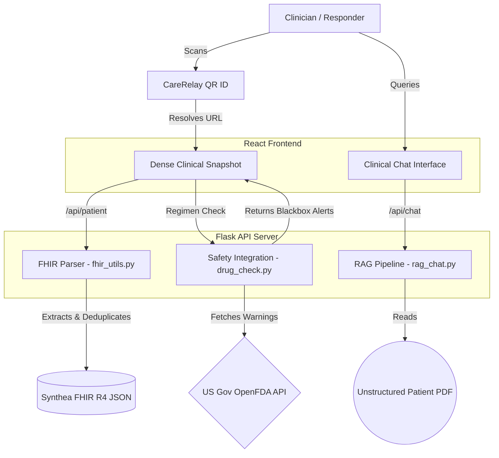
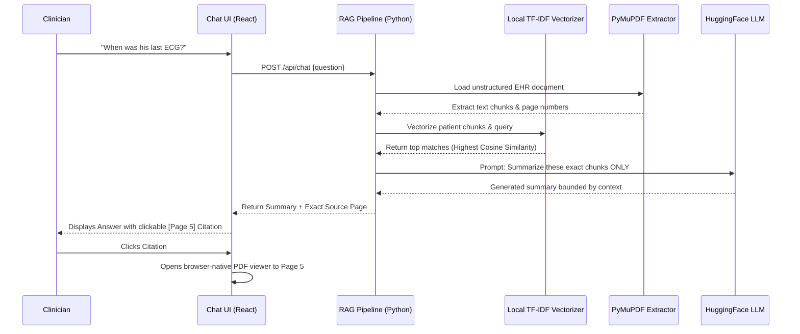

# CareRelay

**Giving Doctors Their Time Back.**
CareRelay is a clinical workflow optimization platform and emergency-access system designed to combat physician burnout and deliver critical patient intelligence when seconds count.

## Team Members
* Binit KC (GitHub: https://github.com/Binit17)
* Smriti Niroula (Nursing Background helped in overall design and implementation)
* Sanskriti Poudel (GitHub: https://github.com/Sanskriti1158)
* Manushi Parajuli (GitHub: https://github.com/manushiparajuli)

---

## The Problem
The modern Electronic Health Record (EHR) is fundamentally broken for point-of-care delivery. It is a billing tool, not a clinical tool. 
* **The "Pajama Time" Crisis:** Based on a landmark 2016 *Annals of Internal Medicine* study, physicians spend 49.2% of their day on EHR charting and desk work, compared to only 27% on face-to-face patient care. 
* **The Data Trap:** According to industry consensus, roughly 80% of healthcare data is unstructured (clinical notes, PDFs, discharge summaries). Standard systems cannot query this efficiently.
* **The Golden Hour:** In emergency care, delays in accessing fragmented medical histories (like unknown life-threatening allergies) severely impact patient outcomes.

## Our Solution
CareRelay bypasses bloated interoperability networks to deliver instant, structured intelligence directly to the clinician via a two-pronged approach:

1. **The Medical ID Protocol:** Patients carry a physical or digital CareRelay ID card. Upon scanning the QR code in an emergency, clinicians immediately access our **Dense Clinical Snapshot**, summarizing critical vitals, conditions, and life-threatening allergies above the fold in under 2 seconds.
2. **Clinical Intelligence & Safety Pipeline:**
   * **Real-time FDA Safety Guardrails:** Active regimens are automatically validated against the **OpenFDA API** to flag black-box warnings and dangerous drug interactions.
   * **RAG-Powered Clinical Chat:** Instead of hunting through a 30-page scanned EHR, doctors ask the CareRelay AI questions. By using a localized Retrieval-Augmented Generation (RAG) pipeline tied exclusively to the patient's record, the system generates answers and provides **clickable PDF citations** that launch the browser-native viewer exactly on the source page.

## System Architecture

Our platform utilizes a multi-layered architecture to process diverse healthcare data securely, combining local vectorization, standard FHIR parsing, and external API integrations for safety.

### 1. High-Level Data & Safety Workflow
This diagram illustrates how CareRelay simultaneously processes dense standard FHIR payloads for the dashboard while interacting with OpenFDA for real-time medication safety.



### 2. Zero-Hallucination RAG Pipeline
This diagram focuses on the Retrieval-Augmented Generation system. By processing the raw EHR PDF locally through TF-IDF rather than passing the whole document to an LLM, we assure HIPAA boundary compliance and strictly mitigate hallucination via PDF source grounding.



## Tech Stack
* **Frontend:** React.js, Vite, Vanilla CSS (Custom Light Theme Design System)
* **Backend:** Python, Flask server
* **Data Layer:** Synthea FHIR R4 (Synthetic Health Data Parsing)
* **AI & NLP Pipeline:** 
  * HuggingFace Inference API (Summarization / AI First Visit Brief)
  * `scikit-learn` (TF-IDF vectorization for strict lexical retrieval)
  * `PyMuPDF` (High-speed PDF text extraction and indexing)
* **Integrations:** OpenFDA API 

## Setup Instructions
To run CareRelay locally, you'll need two terminals for the frontend and backend.

### 1. Start the Flask Backend (Python 3.11+)
```bash
cd projects/CareRelay/src/backend
# Create and activate a virtual environment (optional but recommended)
python -m venv venv
source venv/bin/activate
# Install requirements
pip install flask pymupdf scikit-learn requests
# Export a valid HuggingFace API Key for inference
export HF_API_KEY="your_api_key_here"
# Run the API server (runs on port 5000)
python app.py
```

### 2. Start the Frontend (Node.js)
```bash
cd projects/CareRelay/src/frontend
# Install dependencies
npm install
# Start the Vite development server
npm run dev
```
Navigate to `http://localhost:5173` to view the CareRelay Dashboard.

## Demo
- 🎥 Video Demo: [Watch here](https://drive.google.com/drive/folders/15xEPpjy6-AztsoLH5c_u5KjyDGuE8W4C)
