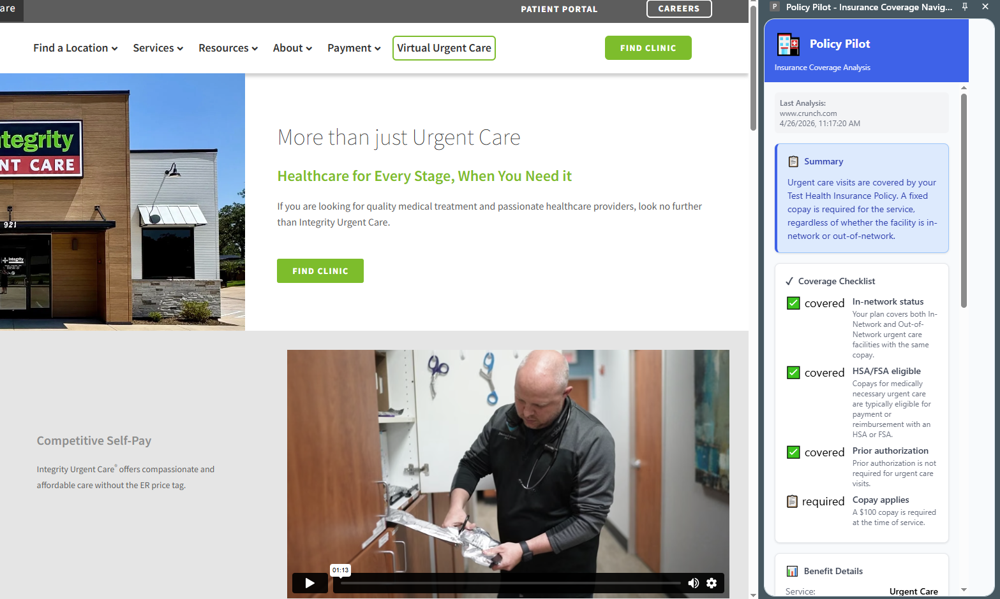
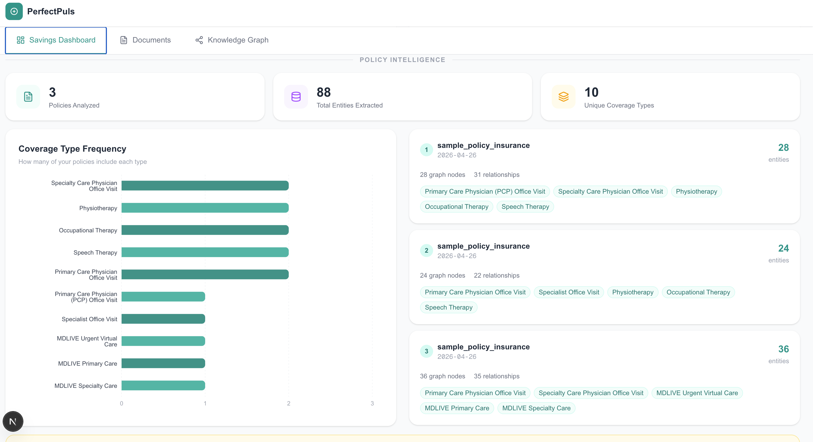
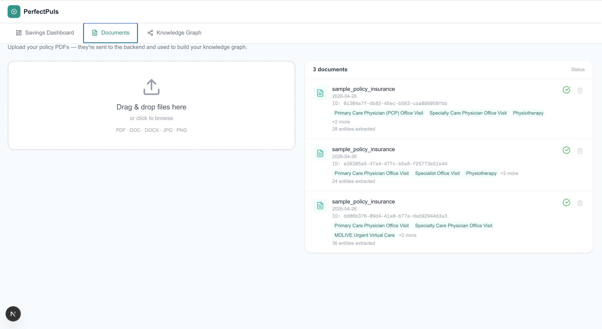
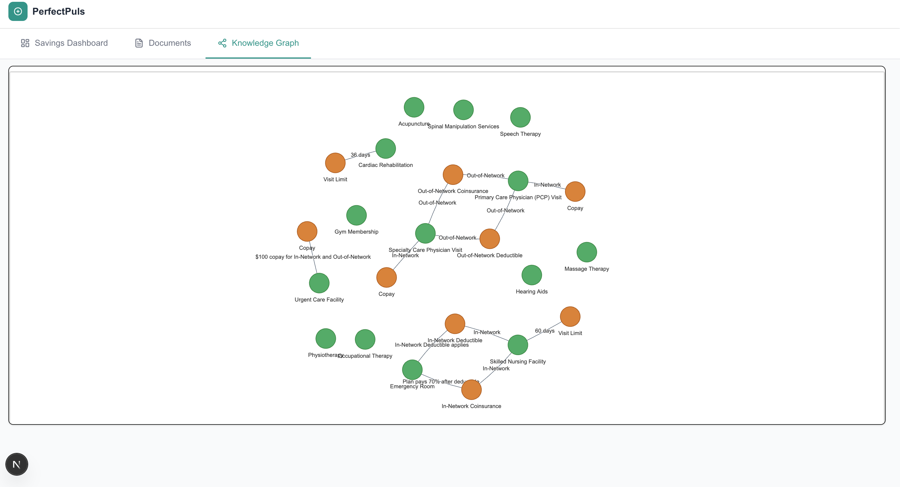

# PerfectPulse

**AI-powered insurance policy analyzer** — upload your health insurance documents, then browse the web knowing exactly what's covered.

Built for the CareDevi AI Innovation Hackathon 2026.

---

## Team name: PerfectPulse

## Team member: Rajan Bastakoti(rbastakoti),Nishu Shrestha(nishu8343),Dhiraj Majhi(dhiraj20),Manash Lamichhane(Manash)

## Problem statement: 
Insurance Policies are "Black Boxes"
Density: Average Summary of Benefits (SBC) is 20–40 pages of dense tables and legal jargon plus there are multiple policy pdfs.
Hidden Constraints: Users often miss critical "shared limits" (e.g., a 20-visit limit shared between Physical and Speech therapy). 68 percent of americans have been surprised by their medical bills.
Missed Value: Policies include "Benefits and Perks" that users rarely find or check daily.
The Search Failure: Standard "Keyword Search" (Ctrl+F) fails to explain relationships between services and rules.

## What It Does

PerfectPulse helps users understand their health insurance coverage in real time:

1. **Upload your policy PDFs** — the backend extracts coverage details using Gemini 2.5 Pro and stores them in a Neo4j knowledge graph.
2. **Browse health & wellness websites** — the Chrome extension detects health-related content and queries your policy for coverage insights.
3. **Visualize your coverage** — the web dashboard shows potential savings, coverage gaps, and a graph of your policy relationships.

---

## Architecture

```
Chrome Extension  ──────────────────────────────────────────┐
(content scraping + side panel)                              │
                                                             ▼
User Frontend (Next.js)  ─── /api/process-pdf ──►  Backend (FastAPI)
(PDF upload, savings                                   │
 dashboard, knowledge graph)         ┌─────────────────┤
                                     ▼        ▼        ▼
                                 Neo4j DB  Cosmos DB  Gemini 2.5 Pro
                                (knowledge  (data     (extraction +
                                 graph +    storage)   synthesis)
                                 vector
                                 search)
```

---

## Project Structure

```
projects/PerfectPulse/
├── README.md
├── responsible-ai.md
└── src/
    ├── backend/           # FastAPI + Neo4j + Gemini (Python)
    ├── user-frontend/     # Next.js 16 + Tailwind CSS + Azure Cosmos DB
    └── chrome-extension/  # Manifest V3 extension (no build step)
```

---

## Components

### 1. Backend

**Stack:** Python · FastAPI · Neo4j · Google Gemini 2.5 Pro  · Cosmos DB

The backend is the intelligence layer. It:
- Accepts PDF policy documents and uses Gemini 2.5 Pro to extract structured coverage data (benefits, limits, exclusions, costs).
- Stores extracted data in Neo4j as a knowledge graph with vector embeddings for semantic search.
- Persists document metadata, user records, and structured policy data in Azure Cosmos DB for durable, queryable storage.
- Accepts website content from the Chrome extension and runs a RAG pipeline (Neo4j vector search → Gemini synthesis) to generate coverage analysis.

**API Endpoints:**

| Method | Path | Description |
|--------|------|-------------|
| POST | `/api/process-pdf` | Upload a policy PDF for extraction and ingestion |
| POST | `/api/analyze` | Analyze website content against stored policies |
| GET | `/health` | Health check |

**Setup:**

```bash
cd src/backend

# Create virtual environment
python -m venv .venv
source .venv/bin/activate        # Windows: .venv\Scripts\activate

# Install dependencies
pip install -r requirements.txt

# Configure environment
cp example.env .env
# Edit .env with your credentials (see below)

# Start the server
python main.py
# Runs on http://localhost:8000
```

**Required environment variables (`.env`):**

```env
GOOGLE_AI_API_KEY=your_gemini_api_key
NEO4J_URI=bolt://localhost:7687
NEO4J_USER=neo4j
NEO4J_PASSWORD=your_neo4j_password
NEO4J_DATABASE=policy_pilot

# Azure Cosmos DB
COSMOS_ENDPOINT=https://your-account.documents.azure.com:443/
COSMOS_KEY=your_cosmos_key
COSMOS_DB_DATABASE_NAME=policydb
COSMOS_DB_CONTAINER_NAME=documents
```

**Neo4j:** Run locally via Docker:
```bash
docker run \
  --name neo4j \
  -p 7474:7474 -p 7687:7687 \
  -e NEO4J_AUTH=neo4j/your_password \
  -e NEO4J_PLUGINS='["apoc", "graph-data-science"]' \
  neo4j:5
```

**Azure Cosmos DB:** Provision via Azure Portal or CLI:
```bash
# Create a Cosmos DB account (NoSQL API)
az cosmosdb create \
  --name your-cosmos-account \
  --resource-group your-resource-group \
  --kind GlobalDocumentDB \
  --default-consistency-level Session

# Create the database
az cosmosdb sql database create \
  --account-name your-cosmos-account \
  --resource-group your-resource-group \
  --name policydb

# Create the container (partition key: /userId)
az cosmosdb sql container create \
  --account-name your-cosmos-account \
  --resource-group your-resource-group \
  --database-name policydb \
  --name documents \
  --partition-key-path /userId
```

Retrieve your endpoint and key from the Azure Portal under **Keys** or:
```bash
az cosmosdb keys list \
  --name your-cosmos-account \
  --resource-group your-resource-group
```

---

### 2. User Frontend

**Stack:** Next.js 16 · React 19 · TypeScript · Tailwind CSS 4 · NextAuth v5 · Azure Cosmos DB

The frontend provides three main views:

- **Documents** — upload PDF insurance policies (forwarded to the backend for processing) and view previously uploaded documents stored in Cosmos DB.
- **Savings Dashboard** — charts showing potential cost savings and coverage comparisons across your policies.
- **Knowledge Graph** — interactive visualization of your policy relationships (benefits, providers, coverage limits).

**Setup:**

```bash
cd src/user-frontend

npm install

# Configure environment
cp .env.example .env.local
# Edit .env.local with your credentials (see below)

npm run dev
# Runs on http://localhost:3000
```

**Required environment variables (`.env.local`):**

```env
# Google OAuth (https://console.cloud.google.com)
GOOGLE_CLIENT_ID=your_google_client_id
GOOGLE_CLIENT_SECRET=your_google_client_secret
AUTH_SECRET=any_random_32_char_string

# Azure Cosmos DB
COSMOS_ENDPOINT=https://your-account.documents.azure.com:443/
COSMOS_KEY=your_cosmos_key
COSMOS_DB_DATABASE_NAME=policydb

# Backend URL
BACKEND_URL=http://localhost:8000
```

**Google OAuth setup:**
1. Go to [Google Cloud Console](https://console.cloud.google.com) → APIs & Services → Credentials
2. Create OAuth 2.0 Client ID (Web application)
3. Add `http://localhost:3000/api/auth/callback/google` as an authorized redirect URI

---

### 3. Chrome Extension

**Stack:** Manifest V3 · Vanilla JS · No build step required

The extension:
- Detects when you visit health and wellness websites (detects keywords: appointment, therapy, clinic, dental, vision, etc.)
- Scrapes the visible page content
- Sends it to the backend `/api/analyze` endpoint with your active policies
- Displays a coverage summary in a Chrome side panel

**Installation:**

1. Open Chrome and go to `chrome://extensions/`
2. Enable **Developer mode** (toggle in the top right)
3. Click **Load unpacked**
4. Select the `src/chrome-extension/` folder
5. The PerfectPulse icon will appear in your toolbar

**Usage:**

1. Make sure the backend is running at `http://localhost:8000`
2. Make sure you have at least one policy uploaded via the frontend
3. Visit any health-related website (e.g., a chiropractor, gym, therapy practice)
4. Click the PerfectPulse extension icon → **Open side panel**
5. The extension will automatically analyze the page and show coverage results

**API target:** Configured in `src/background.js` — defaults to `http://localhost:8000/api/analyze`. Update this if your backend runs elsewhere.

> Note: The extension includes fallback dummy responses so the side panel works even without a running backend, useful for demos.

---

## Running the Full Stack

Start all three components in separate terminals:

```bash
# Terminal 1 — Backend
cd projects/PerfectPulse/src/backend
source .venv/bin/activate
python main.py

# Terminal 2 — Frontend
cd projects/PerfectPulse/src/user-frontend
npm run dev

# Terminal 3 — Chrome extension (no process needed)
# Just load it once in chrome://extensions as described above
```

Then open [http://localhost:3000](http://localhost:3000), log in with Google, upload a policy PDF, and browse a health website with the extension active.

---

## Screenshots

### Chrome Extension — Real-time Coverage Analysis


### Savings Dashboard — Policy Intelligence Overview


### Documents — PDF Upload & Policy Management


### Knowledge Graph — Interactive Policy Visualization


---

## Prerequisites

| Requirement | Version | Notes |
|-------------|---------|-------|
| Python | 3.8+ | Backend runtime |
| Node.js | 18+ | Frontend runtime |
| Neo4j | 4.4+ | Knowledge graph database |
| Google Gemini API key | — | [Get one here](https://aistudio.google.com) |
| Google OAuth credentials | — | For frontend login |
| Azure Cosmos DB | — | For document persistence (optional for local dev) |
| Chrome | 114+ | Required for side panel API |

---

Link to recorded videos: https://drive.google.com/drive/folders/1mWlThlFgliFhSrZ1J5ja2PRA2xzOdWtU?usp=sharing

